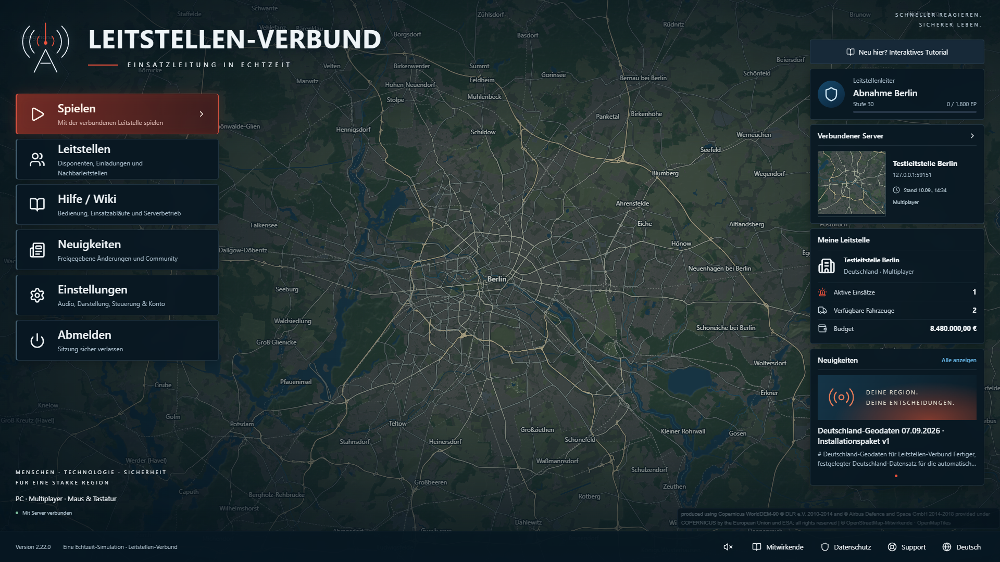
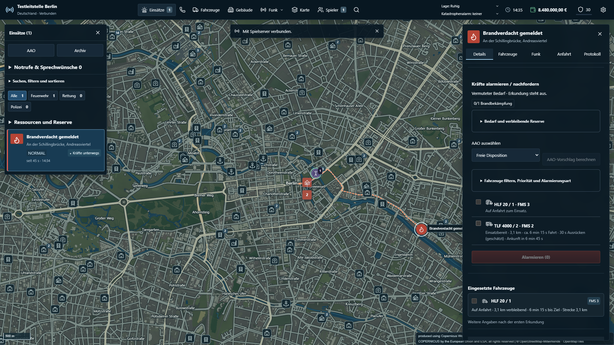

# Deutschland als einziges Produkt – Umbau und Abnahme

Stand: 10.09.2026. Diese Seite beschreibt den Deutschland-only-Umbau ab Ausgangscommit `03e9878217292f1879d71a01a7722e87dc14eb1d`. Konkrete Messläufe und ihre Commits sind ausdrücklich angegeben. Eine spätere Änderung benötigt ihre eigene vollständige Freigabe.

## Entfernte Laufzeit und ihre Nachfolger

| Entfernter Unterbau                                                            | Aktueller zuständiger Teil                                                         |
| ------------------------------------------------------------------------------ | ---------------------------------------------------------------------------------- |
| Weltwahl, Falkenried-/Rivermere-Generatoren, `src/region.ts`, `src/rivermere/` | `src/world.ts`, `src/product.ts`, Deutschlandprovider und geprüftes OSM-Datenpaket |
| `Map.tsx`, `MapTerrain.tsx`, `RegionScene.tsx`, alter Fluss-/Geländerenderer   | `src/germany/GermanyMap.tsx` und `GermanyScene.tsx`                                |
| Allgemeine Mathematik im Altweltnetz                                           | Weltneutrale `src/geometry.ts`                                                     |
| Zwei Produktbuilds und `dist/germany/` als parallele Ausgabe                   | Genau `dist/client/` und `dist/server/`                                            |
| Automatische fiktive Kartenumstellung und alte Weltvorschau                    | Begrenzte, schreibgeschützte Formatbrücke mit ehrlicher Weltkonfliktmeldung        |
| Normal-/Last-Zweistart bei jeder Browserprüfung                                | Ein normaler Aufruf oder ausdrücklich ausgewählter isolierter Lastlauf             |

Es gibt keine alte Karte, offline simulierte Ersatzwelt oder aktive Einzelspielerauswahl. Die vorhandene obere Hauptleiste öffnet Karte, Einsätze, Fahrzeuge, Gebäude, Funk und Spieler. Notrufablauf, Zusammenarbeit, Euro/XP, Audio, Tutorial und Konten verwenden weiterhin die vorhandenen Produktionsmodule.

Zusätzlich korrigiert wurden reale öffentliche Klinikpräferenzen mit stabiler OSM-Kennung, die tatsächliche Fahrzeuggeschwindigkeit, Kameraposition beim Menüwechsel, geschlossene Detailbereiche in der Tastaturfokusfolge und die Checkboxauswertung bei freier Disposition. Bestätigt unerreichbare Straßenkandidaten werden vom Generator verworfen; Routingausfälle bleiben Fehler und erzeugen keine erfundene Strecke.

## Bestandsschutz

Schema 18 bleibt das aktuelle Datenbankschema. Es wurde kein neues Schema allein für die Bereinigung eingeführt. Die vorhandenen versionierten Deutschland-Migrationen bleiben erhalten. Welt, Schema und Datensatz werden vor schreibender Öffnung geprüft.

Fiktive Koordinaten besitzen keine verlässliche Deutschlandzuordnung. Statt Wachen willkürlich zu versetzen, exportiert `retired-export` die komplette alte SQLite schreibgeschützt in ein neues Ziel. Guthaben, Konten, laufende Aufgaben und weitere Tabellen bleiben erhalten. Der kleine Altformatleser, ältere Deutschland-Schemata, inaktive Soloarchive, alte Klinikpräferenzen, frühere Fahrprofile und die Abschaltung eigener alter Offline-Caches sind in der [Kompatibilitätstabelle samt Entfernungskriterien](KOMPATIBILITAET.md) begründet.

Build, Git-Push und diese Tests haben keine privaten AMP-Daten migriert, gelöscht oder eine Produktionsinstanz aktualisiert. Neu eingerichtete Testkonten und Spielstände lagen in getrennten temporären Ordnern. Große vorhandene lokale Geodaten wurden genutzt, nicht neu importiert.

## Übertragene Anforderungen und Testdaten

[TESTMIGRATION.json](TESTMIGRATION.json) enthält die vor Entfernung angelegte Zuordnung für 127 alte Testdateien: 124 erhaltene fachliche Bereiche und drei gemischte Altwelt-/Nachfolgerfälle. Die alten `world`-/`rivermere`-Tests werden nicht als aktive Welt weitergeführt. Ihre weiterhin gültigen Anforderungen an Bebaubarkeit, Routing, Weltgrenzen, Persistenz und Bedienung stehen in den aktuellen Deutschland- und Kompatibilitätstests.

Phasennamen wurden durch `call-dispatch`, `staffing-operations`, `mutual-aid`, `incident-dynamics` und `reports-replay` ersetzt. Die fachlichen Abläufe bleiben geprüft. Kleine Deutschland-Fixtures enthalten bekannte Berliner Straßenanker, gültige SQLite/MBTiles, feste Simulationszeit/Seeds und eigene Datenbanken/Sitzungen. Allgemeine Vorbereitungen verwenden tatsächliche Gebäudekäufe und automatische Besetzung; sie spielen keine manuelle Rekrutierung mehr durch.

Der externe Router wird in kleinen Vertragsprüfungen ausdrücklich durch einen nachvollziehbaren Lieferanten ersetzt. Produktionsserver, Authentifizierung, Datenbank, Routingadapter, MapLibre und Synchronisation laufen tatsächlich. Separat prüfen echte OSM-/DEM-Werkzeuge die Datenverarbeitung; lokale Voll-Datensatz-Läufe benutzen den wirklichen GraphHopper.

## Ausgeführte Prüfungen

[Vollständige GitHub-Abnahme 34475766884](https://github.com/Philipp284868/Leitstellen-Verbund/actions/runs/34475766884), Commit `207f9b8`: **1210 Logikfälle, 16 Node-Betriebsfälle, 92 Chromiumfälle, 91 Firefoxfälle und zwei isolierte Kartenlastfälle erfolgreich**. Keine Fehler, Skips oder Flakiness in den Pflichtgruppen. Hinzu kommen Struktur/Format/Lint/Typen, Geodatenwerkzeuge, Abhängigkeitssicherheit und zweimal identisch gepackte Linux-Ausgabe mit echter Registrierung, idempotentem Bau, sauberem SIGTERM-Stopp und persistentem Neustart.

Die zusätzliche Clipboard-Berechtigungsprüfung benutzt Chromium-CDP und ist vorab nur dieser Engine zugeordnet. Gemeinsame Support- und Clipboard-Fallback-Anforderungen laufen auch in Firefox. Der alte Ausgangslauf hatte diesen Sonderfall in Firefox übersprungen; der neue Gesamtstatus akzeptiert keinen unerwarteten Skip.

[Schneller Lauf 34476510590](https://github.com/Philipp284868/Leitstellen-Verbund/actions/runs/34476510590), Commit `b115785`: **24 Logikfälle und je sechs Kernabläufe pro Browser erfolgreich**, zusätzlich Struktur/Lint/Typen/Build. Auslöser war ausschließlich die Vorbereitung von Audiosnapshots ohne zufällige Einsatzgenerierung. Dieser Umfang berechtigt nicht zum Release.

Fehlende Pflichtgruppen, abgebrochene Prozesse, falsche Commit-/Paketbindung und verlorene oder doppelte Shards werden in den Vertragsprüfungen tatsächlich provoziert und müssen abgewiesen werden. Der vorherige [fehlgeschlagene Linux-Lauf](https://github.com/Philipp284868/Leitstellen-Verbund/actions/runs/34474163705) wurde korrekt rot; seine UI-/Testvorbereitungsfehler wurden repariert und nicht durch schwächere Assertions oder Retries verborgen.

## Aktuelle Produktbilder und echte Geodaten

Der lokale Voll-Datensatz-Lauf vom 10.09.2026 durchlief Anmeldung, zwei echte Browseransichten derselben Leitstelle, Notruf, freie Alarmierung, 102 Punkte echten Straßenwegs, FMS, Serverneustart, Lagemeldung, Nachforderung, Abschluss, Historie und tatsächlichen Gebäudebau. Elf Bilder wurden aufgenommen, darunter vier Desktopauflösungen. Keine Browserfehler und keine fehlgeschlagenen Anfragen. Zwei aussagekräftige Bilder bleiben im Checkout; Rohbilder und Traces werden nicht gesammelt.

[Kompakter Geodatennachweis](abnahme-deutschland/real-data.json). Die zugrunde liegenden Vektor-/Suchdaten tragen Kennung `155596c0…`, das Copernicus-Höhenmodell `d8b7d65b…`; vollständige Fingerprints stehen im Nachweis.

## Grenzen des zusätzlichen Extremtests

Der separate reale Großlastlauf hat 20 Wachen, 500 regulär gekaufte HLF, 4500 automatisch gestellte Einsatzkräfte, zwölf vorbereitete Einsätze und 100 echte Straßenfahrten. Alle fünf Kartenphasen liefen mit weiterhin 100 fahrenden Fahrzeugen durch. Er beobachtete vollständige Erstübertragung und eine Folgesynchronisation ohne erneute Routengeometrie.

Sein Status lautet ausdrücklich **measured-with-findings**: einzelne Framepausen bis 1345,5 ms, sehr große Folgeansichten um 8,5 MB und nur vier beobachtete Snapshotframes im Messfenster. Das ist kein Nachweis für durchgehend flüssigen 500-Fahrzeug-Betrieb. Eine weitergehende Begrenzung/Verkleinerung großer Ansichten bleibt ein konkretes Leistungsthema. [Messwerte und Grenzen](abnahme-deutschland/real-load.json). Diese Grenzen werden nicht mit den bestandenen kleinen CI-Fixtures gleichgesetzt.

## Laufzeit, Build und Freigabe

Die frisch gemessene bisherige vollständige CI dauerte **17:05 Minuten**, die neue vollständige Abnahme **6:46 Minuten**, das begrenzte Profil **3:20 Minuten**. Es wurden keine teureren Runner verwendet. Kalter lokaler Deutschlandbuild: **7,163 s**; warmer Build: **3,088 s**; Struktur/Lint/Typen: **5,908 s**. Entwicklungsanmeldung: **2,840 s**, echte HMR-Änderung ohne Neuladen: **88 ms**. Einzellaufwerte, keine statistische Serie. Der warme Vorgängerbuild war mit 2,339 s etwas schneller.

[Vollständiger Zeitvergleich](TESTLAUFZEITEN.md) · [Lokale Einzelmessungen](abnahme-deutschland/local-messung.json) · [CI-Aufteilung](abnahme-deutschland/ci-messung.json).

Ein gemeinsamer Build pro Commit liefert geprüfte Dateien an die Jobs. Client-/Servereingaben sind getrennt gehasht; gemeinsame Quellen invalidieren beide. Typen werden immer geprüft, Testerfolge nie gecacht. Die neue Shardgewichtung verwendet gemessene Deutschland-Dateizeiten. Normale Builds laden keine Geodaten.

Der Gesamtstatus ist an Profil, Pflichtgruppen, ausgeführte Dateien, Commit und Paketbytes gebunden. Ein Release verlangt den exakten aktuellen main-Stand mit vollständiger Abnahme und Code-Sicherheit. Der manuelle Releaseworkflow prüft standardmäßig mit nur lesenden Rechten; ein Entwurf benötigt die ausdrückliche Auswahl und einen getrennten Job. Bereits geprüfte Paketbytes werden heruntergeladen, nicht neu gebaut. Bestehende Tags und Releases bleiben unverändert.

## Aufgeräumter Arbeitsbaum und Betrieb

106 historisch gesicherte Dokument-/Bilddateien mit 94,6 MiB wurden entfernt. Der [Historienindex](HISTORIE.md) verlinkt ihre unveränderlichen Originalstände. Verbliebene frühere Berichte sind als historisch gekennzeichnet. Aktuelle Betriebs-, Architektur-, Daten-, Katalog- und Wikiquellen sind auf Deutschland ausgerichtet. Die Strukturprüfung kontrolliert aktive Links, verbotene alte Einstiege, dynamische Importgrenzen sowie vollständige und eindeutige Testzuordnung.

Die funktionierenden Befehle für `dev`, `build`, `build:fast`, `start`, `preview`, `check:quick`, `test:quick`, `test:e2e` und `test:full` stehen mit ihrem tatsächlichen Umfang in der [Entwicklungsanleitung](ENTWICKLUNG.md). [AMP-Setup und Sicherungen](AMP.md), [ausdrückliche Neuinstallation](AMP-NEUINSTALLATION.md) und [Runtime-Paket](RUNTIME-PAKET.md) sind die Betriebsanleitungen.

Die Arbeit erfolgt direkt auf `main` mit normalen Commits und Pushes. Diese Seite veröffentlicht kein Release, keine externe Wiki und keinen privaten Server. Für die Freigabe eines späteren main-Stands ist dessen eigener abgeschlossener Actions-Lauf maßgeblich.
